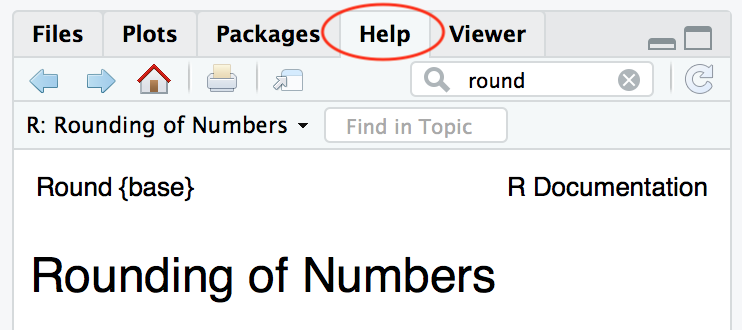

Welcome to Biostats Recitation!
========================================================
author: Eric Scott, Avalon Owens
date: 
autosize: true

Information
========================================================

Office Hours:

- Avalon:
- Eric:

Objectives
========================================================

- Build a toolset to work with, explore, visualize, and analyze data
- Become familiar with resources to help learn more on your own
- Apply concepts learned in lecture to new situations
- Get the tools you need to work through homework assignments

Expectations
========================================================

- **Attendance** (Recitation is required)
- **Collaboration** 
    - Ask for help from your classmates
    - Ask your classmates if they need help
- **Experiment, play, and have fun with R!**


Why R?
========================================================
- Open source (free!)
- Vibrant, helpful, friendly community online
- Reproducibility of code vs. point-and-click
- Used in many data-science, statistics, and science jobs

What is R? What is R Studio?
========================================================
R is a programing language, but it's one that's designed to work interactively.

```r
x <- 25
```
That means I can run one line of code at a time, instead of having to write a whole *program*.

```r
x^2
```

```
[1] 625
```
This makes it easy to learn and debug

What is R? What is R Studio?
========================================================
R Studio is an integrated development environment, or IDE.  Think of R as a car's engine and RStudio as the car's dashboard.

R: Engine            |  RStudio: Dashboard 
:-------------------------:|:-------------------------:
  |  


In this class we will always interact with R through RStudio, never directly.


Tour of RStudio
========================================================
Launch RStudio


Launch RStudio            |  **NOT** R 
:-------------------------:|:-------------------------:
  |  


Review of DataCamp lesson
==================================
## R as a calculator

```r
5+5
12/2
44*15
10^10
```

```
[1] 10
[1] 6
[1] 660
[1] 1e+10
```

Review of DataCamp lesson
==================================
## Variable Assignment

```r
x <- 2
y <- 3
x + y
```

```
[1] 5
```

```r
z <- "Hello"
z
```

```
[1] "Hello"
```

Review of DataCamp lesson
==================================
## Functions

```r
sqrt(25)
abs(-5)
round(1.522222, digits = 3)
```

```
[1] 5
[1] 5
[1] 1.522
```

Getting Help
==================================
With R code:


```r
?round
#or
help(round)
```

Getting Help
==================================
With RStudio help tab:



Getting Help
==================================
With Google:
- Include "R" or "rstats" and the name of the function in your search
- Stack Overflow and blog posts can be good sources

Social Media:
- #rstats and #r4ds (R for Data Science) are often very helpful on **Twitter**
- The R community is usually *very* friendly to beginners.

Getting Help
==================================
## Come to office hours!
- *All* of the TAs for this course know R and use it for their work

Packages
==================================
- Packages extend the capabilities of R
- Think of them like apps for a smartphone
- For example, the `abd` package contains all the datasets used in your textbook
- We will use `abd`, `ggplot2`, and `dplyr` heavily in this course
- Install R packages using the "Packages" tab in RStudio


Install Packages
==================================
- Install `abd` and `ggplot2` now
    + Packages only need to be installed **once**
- Load packages with `library(package_name)`
    + Packages need to be loaded **once per R session**

Visualize Data
==================================

```r
head(iris)
```


| Sepal.Length| Sepal.Width| Petal.Length| Petal.Width|Species |
|------------:|-----------:|------------:|-----------:|:-------|
|          5.1|         3.5|          1.4|         0.2|setosa  |
|          4.9|         3.0|          1.4|         0.2|setosa  |
|          4.7|         3.2|          1.3|         0.2|setosa  |
|          4.6|         3.1|          1.5|         0.2|setosa  |
|          5.0|         3.6|          1.4|         0.2|setosa  |
|          5.4|         3.9|          1.7|         0.4|setosa  |

- What is the `iris` dataset?
- What does the `head()` function do?


Visualize Data
==================================


The Grammar of Graphics
==================================
`ggplot2` is based on a data visualization framework called the "grammar of graphics"
The short version is:
>A statistical graphic is a mapping of **data** variables to **aes**thetic attributes of **geom**etric objects.

All plots require three parts:

1. `data`, which must be a data frame
2. A `geom`, which describes how the data are to be plotted (points, lines, boxplots, etc.)
3. `aes`, which describes the aesthetic mapping of variables to representation by the `geom`


Aesthetic Mapping
==================================


- What variable is mapped to `x`?
- What variable is mapped to `y`?
- What variable is mapped to `color`?
- What variable is mapped to `size`?

ggplot2 Code
==================================

```r
library(ggplot2)

ggplot(iris, aes(x = Sepal.Length,
                 y = Sepal.Width,
                 color = Species,
                 size = Petal.Length)) +
  geom_point()
```

- Find the `data`, the aesthetic mappings, and the `geom`
- Try changing them!

Recreate plots in chapter 2 of abd
==================================
Sara wants the first week to be all about plotting

- stripcharts/jitter plots
- histograms
- faceting
- violin plots


Week 1 Code Cheatsheet
==================================

function|purpose|example
--------|-------|-------
`help()`|get help on how to use a function| `help(geom_point)`
`library()`|load an already installed package|`library(ggplot2)`
`ggplot()`|set up a ggplot.  Data and aesthetic mappings go in this function|
`geom_*()`|Use `geom_*` functions to map aesthetics to geometry| `ggplot(iris, aes(x = Species, y = Sepal.Width)) + geom_boxplot()`

